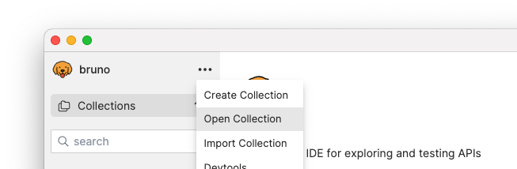
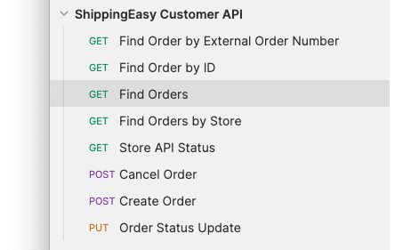
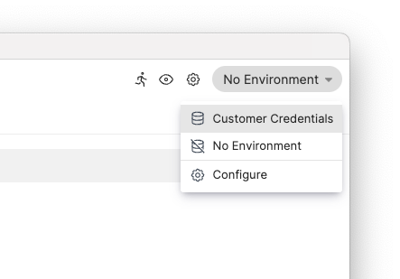
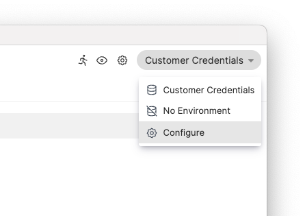
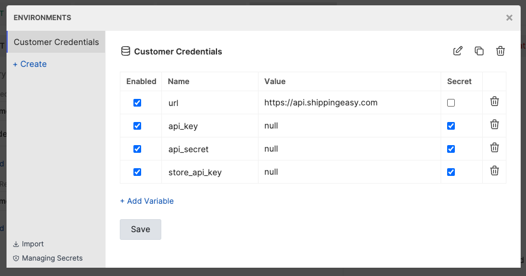
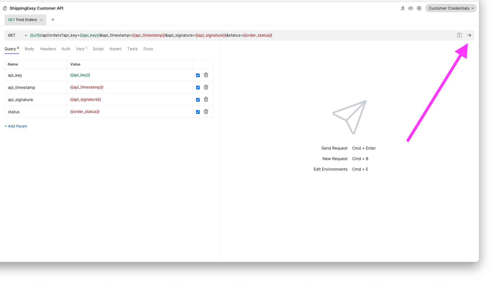
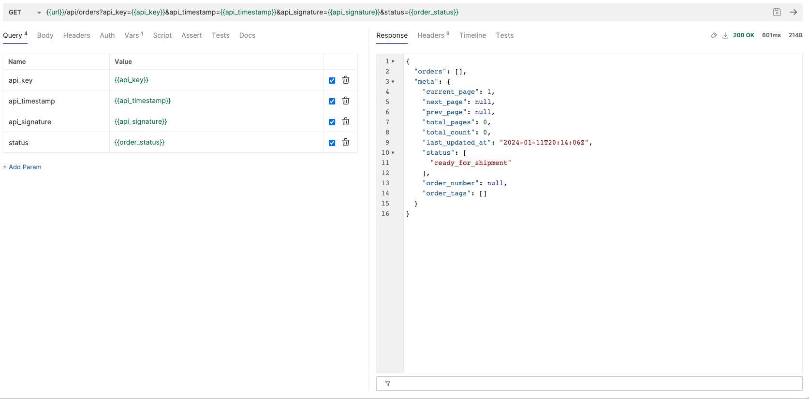
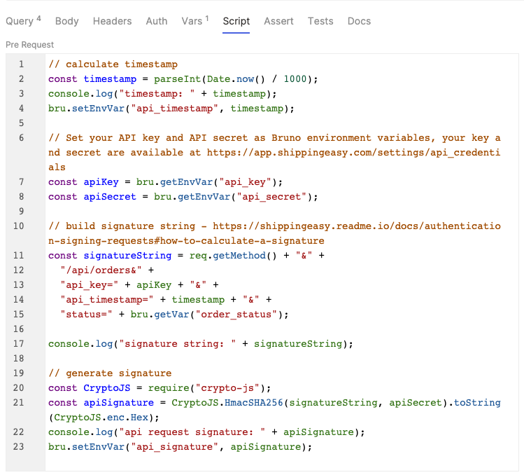

# ShippingEasy Bruno API Examples

This repository contains example API calls for the ShippingEasy APIs. The examples are written as Bruno API files. [Bruno](https://www.usebruno.com/) is an open source API client similar to [Postman](https://getpostman.com) or [Insomnia](https://insomnia.rest/).

## To Use:

1. Clone This Repository

1. Install Bruno Desktop Client from https://www.usebruno.com/

1. Open the Collection in Bruno

   In Bruno, click on the `Open Collection` item in the `...` menu.

   

   Navigate to the `customer_api` directory in this project.

1. Select the `Find Orders` API from the ShippingEasy Customer API collection

   

1. Select the Customer Credentials environment

   Select the `Customer Credentials`` option from the Environments menu in the upper right.

   

1. Enter your API Credentials

   Select the `Configure` option from the Environment drop down in the upper right.

   

   This will open the Environments modal. In the modal, enter your `api_key` and `api_secret` in the Value column. These values for your account can be found in the ShippingEasy UI under [Settings > Account Settings > API Credentials](https://app.shippingeasy.com/settings/api_credentials).

   

1. Run the API call by clicking on the arrow in the upper right.

   

   You should see a JSON payload in the right window pane if the API call was successful.

   

## Authentication Signature Calculation

In addition to the API key, the ShippingEasy API requires an authentication signature. Calculation of that signature is described in the [documentation here](https://shippingeasy.readme.io/reference/authentication-signing-requests). This Bruno collection also provides a Javascript implementation of this signature calculation. You can view the Javascript implementation by clicking on the `Script` tab in Bruno.

This Javascript implementation has some additional logging available in Bruno's Javascript console. View the Javascript console in Bruno by selecting `Toggle Developer Tools` in Bruno's `View` Menu.

This signature calculation can be difficult to implement. ShippingEasy provides a signature calculation debugging tool to help on the Settings page of ShippingEasy UI [Settings > Account Settings > API Credentials](https://app.shippingeasy.com/settings/api_credentials).

## ShippingEasy Customer API

The ShippingEasy Customer API is designed around the use case of sending orders to ShippingEasy for processing and fulfillment. ShippingEasy supports [many marketplaces with built in integrations](https://shippingeasy.com/integrationpartners/), however this API will be useful if you need to build a custom integration for an unsupported marketplace.

If you are looking for a more full featured API for shipping and logistics, we encourage you to look at another Auctane brand, [ShipEngine](https://www.shipengine.com/)

API doc is available here: [ShippingEasy Customer API Doc](https://shippingeasy.readme.io/reference/getting-started)
